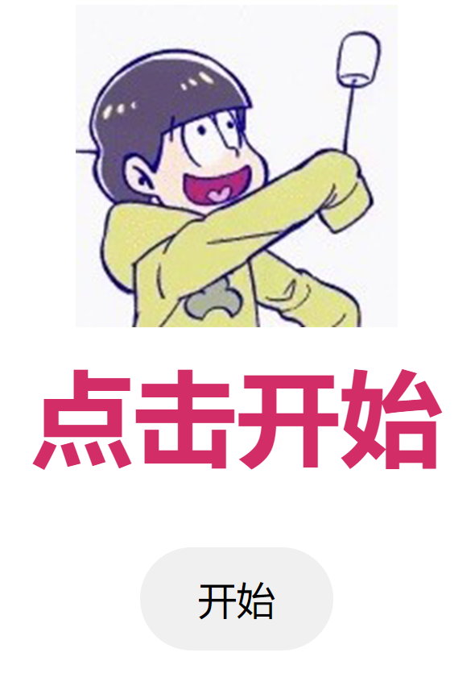
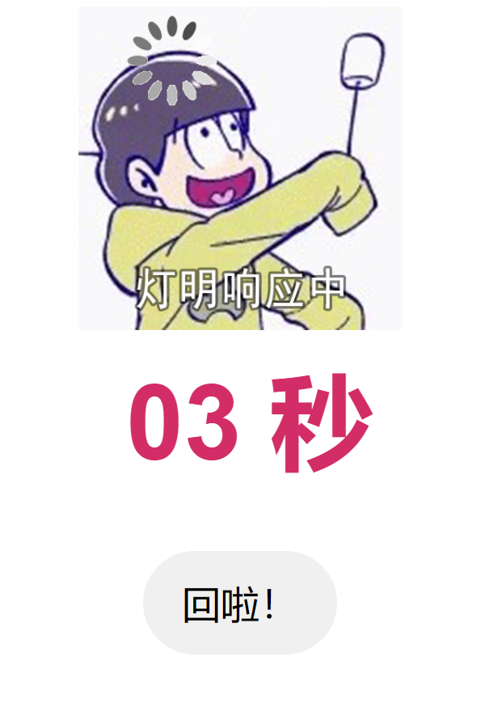
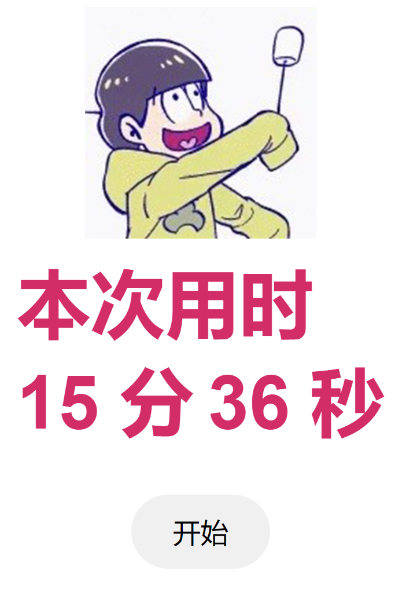

# kashiu-loading

カシウ 响应中

カシウ 是我一朋友，由于回信息太慢，于是做了这个程序

> 也可能只是单纯不想搭理我

# 使用

点击开始后会记录开始时间，并保存在 `hash` 中：`#2024-01-18%2000%3A31%3A34`

此时只需要复制这个地址，等回信

回信后打开复制的地址，会计算时间差，并再次保存新 `hash`：`#2024-01-18%2000%3A31%3A34~2024-01-18%2000%3A47%3A10`

